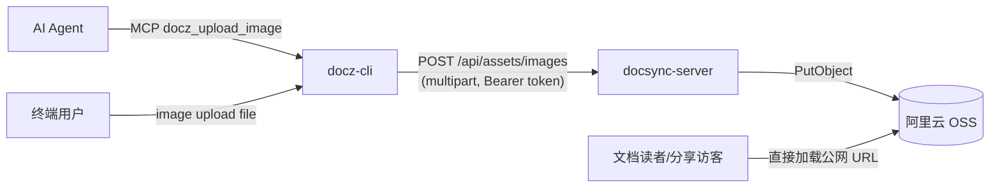

# Design: docz-cli 图片上传（image upload 命令 + MCP 工具 docz_upload_image）

## 方案概述

### 背景

AI agent 通过 MCP 写 Docz 文档时需要配图，docz-cli 缺少图片上传能力；服务端 OSS 图床接口 `/api/assets/images` 已存在（Web 编辑器与博客在用），只缺 CLI/MCP 封装。

### 目标

在 docz-cli 中新增 `image upload <file>` 命令与 `docz_upload_image` MCP 工具，上传图片返回永久公网 URL，可直接嵌入 Markdown，分享链接/博客无登录可见。**不解决**：服务端任何改动；Space 内相对路径图片方案（已有 `upload` + blob 渲染通路覆盖）。

### 范围边界



### 核心价值

AI agent 写文档可自助配图；图片不占 Space 配额；URL 永久有效且无登录态要求，覆盖分享页/博客场景。

## 整体设计

### 领域名词定义

| 名词 | 英文 | 定义 |
|----|----|----|
| 图床 | asset image storage | 服务端 `/api/assets/images` 背后的 OSS bucket，按 `docz-markdown/YYYY/MM/<user>/<ts>-<uuid>` 组织 object key |
| 公网 URL | public URL | 服务端基于 OSS `public_base_url` 拼出的永久直链，无需鉴权 |

### 系统用例

1. 用户在终端执行 `docz-cli image upload ./shot.png`，获得 URL 与 Markdown 引用
2. AI agent 调用 MCP 工具 `docz_upload_image` 上传本地图片，将返回的 Markdown 引用写入文档

### 方案选型

服务端接口与鉴权方式均已确定（`/api/assets/images` 支持 API Token，见 conan-docz `middleware/auth.go` 的 JWT→API Token fallback），无多方案对比必要。唯一决策点：MCP 工具入参用**本地文件路径**而非 base64 —— MCP server 与 agent 同机运行，路径直读避免 base64 膨胀 token 消耗。

### 模块划分及职责

| 模块 | 文件 | 职责 |
|----|----|----|
| API 封装 | `src/client.ts` | `uploadImage(content: Buffer, filename: string): Promise<UploadImageResult>`，multipart POST，复用 `request()` 的鉴权与错误处理 |
| CLI 命令 | `src/commands.ts` | `image upload <file>`：前置校验（存在性/扩展名/大小）→ 调 client → 输出 URL + Markdown |
| MCP 工具 | `src/mcp.ts` | `docz_upload_image`：同 CLI 校验策略，成功返回 `ok()`、失败 `fail()` |
| 共享校验 | `src/commands.ts` 导出（或就近复制常量） | `IMAGE_EXTS = ['png','jpg','jpeg','webp']`、`IMAGE_MAX_SIZE = 5MB`，CLI 与 MCP 共用 |

### 接口契约（服务端已有，仅消费）

```
POST /api/assets/images
Authorization: Bearer <token>      # JWT 或 API Token 均可
Content-Type: multipart/form-data  # file 字段必填；scope 可选（默认 markdown）

200: {"url":"https://<bucket>.<endpoint>/docz-markdown/...","object_key":"...","content_type":"image/png","size":12345}
400: unsupported image type / extension mismatch
401: unauthorized
413: image too large (>5MB)
503: asset storage unavailable（OSS 未配置）
```

### 关键设计点

1. **前置校验在客户端复刻服务端规则**（png/jpg/jpeg/webp、≤5MB）：不合规直接报错不发请求，错误信息比服务端裸 HTTP 错误友好；服务端仍是最终裁决（魔数检测、扩展名一致性）。
2. **CLI 输出格式**：两行 —— `URL: <url>` 与 `Markdown: `，方便人工复制与 agent 解析。
3. **MCP 工具描述**中明确"返回永久公网 URL、可嵌入 Markdown、不占配额、分享/博客无登录可见"，让 agent 自主决策何时使用。
4. **错误透传**：服务端非 2xx 由 `request()` 统一抛 `Error("<status> <statusText>: <body>")`，CLI/MCP 直接呈现。

## 测试设计

### 自动测试方法

- **单元测试**（vitest + msw，本地执行，CI 同跑）：mock `POST /api/assets/images`，覆盖 client 层成功/失败路径与 CLI/MCP 前置校验。本仓库测试体系为本地 vitest，不依赖 test-uts 环境；端到端依赖真实 OSS bucket 配置，无法在 mock 环境验证，故 test-uts 不适用。
- **冒烟验证**（手工，发布前一次）：用 test 环境（docz-test.zhenguanyu.com）token 执行 `node dist/index.js image upload <真实png>`，确认返回 URL 可匿名访问。

### 测试用例

| # | 场景 | 步骤 | 预期 |
|---|------|------|------|
| 1 | client 上传成功 | `uploadImage(pngBuffer, 'a.png')`，msw 返回 200 JSON | 解析出 url/object_key/size；请求为 multipart 且含 file 字段 |
| 2 | 服务端 413 | msw 返回 413 | 抛 Error 含 "413" |
| 3 | 服务端 400 类型不支持 | msw 返回 400 unsupported image type | 抛 Error 含错误文案 |
| 4 | CLI 拒绝 gif | `image upload x.gif` | 退出码非 0，提示支持格式，无 HTTP 请求 |
| 5 | CLI 拒绝超 5MB | 构造 6MB 临时文件 | 退出码非 0，提示超限，无 HTTP 请求 |
| 6 | MCP 文件不存在 | `docz_upload_image` 传不存在路径 | 返回 fail 文案，无 HTTP 请求 |
| 7 | MCP 上传成功 | 传合法 png 路径，msw 200 | 返回含 URL 与 `` 的成功消息 |

### 验证命令

```bash
pnpm typecheck && pnpm lint && pnpm test && pnpm build
```

### 风险覆盖

- 鉴权失效（401）→ 用例 2/3 同路径统一透传验证
- OSS 未配置（503）→ 错误透传机制覆盖（与 413/400 同路径）
- 大文件/坏类型 → 用例 4/5 客户端拦截，避免无效流量
- 回归：现有命令与 MCP 工具不受影响（全量 `pnpm test` 兜底）
