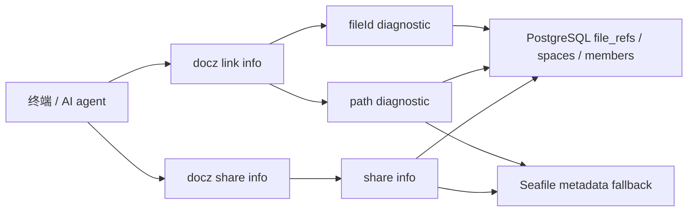
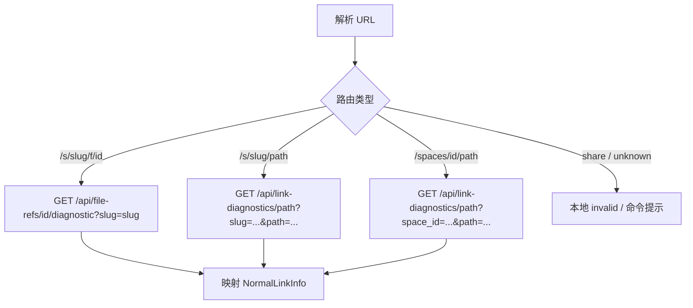
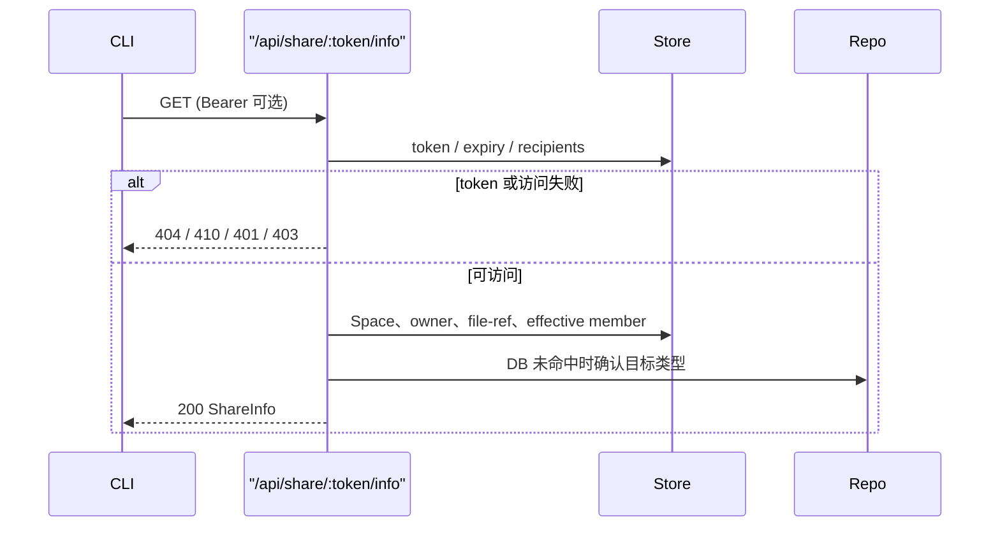

# Design: Docz CLI 链接元信息查询

## 方案概述

### 背景

普通 Docz 链接与分享链接目前分别散落在 URL 解析、file-ref、Space lookup 和 share info 接口中，CLI 没有不读取正文即可判断链接、权限和目标状态的入口。

### 目标

提供两个独立 CLI 命令与两套输出契约，通过服务端只读诊断聚合准确区分链接生命周期、访问权限、文档状态和未知态；不扩大正文读取权限，不引入新存储。

### 范围边界



不解决：恢复已删除文档、改变 Space 或分享权限、持久化被撤销分享链接墓碑、统一两个命令的 JSON 字段。

### 核心价值

- agent 可在读取前可靠判断链接和目标状态
- 无空间权限、链接无效和文档删除不再混为一类
- 分享链接生命周期与当前查看者访问状态独立表达
- `--json` 可直接用于脚本分支判断

## 整体设计

### 领域名词定义

| 名词 | 英文 | 定义 |
|---|---|---|
| 链接状态 | link status | 链接标识或分享 token 的生命周期，不表示正文是否存在 |
| 文档状态 | document status | 链接目标当前是否存在；Space 根目录为不适用 |
| 空间权限 | space permission | 当前 API Token 用户是否为 Space effective member |
| 访问状态 | access status | 当前查看者能否使用分享链接，与 Space 成员身份独立 |
| 未知态 | unknown | 请求或响应不足以确认事实，不能降级为否定结果 |

### 系统用例

1. 查询稳定普通短链接，包括无 Space 权限、软删除和 alias
2. 查询路径型、Space 根和 legacy 普通链接
3. 查询公开、受限、过期和无效分享链接
4. 使用人类可读输出排障
5. 使用 JSON 输出驱动脚本或 agent 决策

### 方案选型

| 方案 | 服务端 | CLI | 结论 |
|---|---|---|---|
| CLI 聚合现有接口 | 无改动 | 多请求拼装 | 路径、软删除和分享目标状态不可靠 |
| 分类型诊断 | 普通与分享分别补充事实 | 两个命令独立映射 | **采用**：语义明确、复用现有接口 |
| 统一 URL 诊断 API | 服务端解析完整 URL | 单一模型 | 服务端与前端域名/路由耦合，且掩盖权限差异 |

### 模块划分及职责

| 模块 | 核心职责 |
|---|---|
| 服务端 file-ref/path diagnostic | 返回普通链接所需事实，不授予正文读取权限 |
| 服务端 share info | 在现有分享鉴权后返回分享目标事实；HTTP 状态表达 token 生命周期与访问拒绝 |
| `DocSyncClient` | 调用诊断接口并保留 401/403/404/410 的结构化语义 |
| CLI URL parser | 只识别本命令允许的 URL 类型并生成请求参数 |
| CLI formatter | 分别输出普通、分享的人类格式和 JSON 格式 |

无数据库结构变化。现有 `file_refs.is_dir/deleted_at`、`share_links`、`spaces.owner_id` 和 effective member 查询足够支持诊断。

## 普通链接元信息

### 状态模型

| 事实 | CLI 值 |
|---|---|
| fileId active/deleted/alias 或有效路径路由 | `link_status=valid` |
| fileId、Space 路由或 URL 格式无法解析 | `link_status=invalid` |
| 传输、5xx、非法 JSON | `link_status=unknown` |
| active file/folder | `document_status=exists` |
| soft-deleted ref 或确认路径不存在 | `document_status=not_found` |
| Space root | `document_status=not_applicable` |
| 链接无效或事实不可确认 | `document_status=unknown` |

`is_folder` 为 nullable boolean。软删除 ref 保留历史 `is_dir`；无法确认类型时为 `null`。

### 普通链接流程



路径诊断查找顺序：

1. 解析 Space；不存在返回可解析 JSON 的 404
2. 计算当前用户 effective member 与 owner contact
3. 空路径直接返回 Space 根
4. 查询 active file ref
5. 查询最近的 soft-deleted file ref
6. DB 未命中时只读调用 `CatFileType` 确认尚未建立 ref 的文件/目录
7. 确认不存在时返回有效路径链接 + 文档不存在

### 普通接口

| 接口 | 变更 |
|---|---|
| `GET /api/file-refs/:id/diagnostic?slug=` | 复用；CLI 消费现有 link/access/document/path/owner/is_dir 字段 |
| `GET /api/link-diagnostics/path?slug=&space_id=&path=` | 新增；JWT/API Token 鉴权，只返回元数据 |

路径诊断响应沿用 file-ref diagnostic 的事实字段，并增加 `document_applicable`：

```json
{
  "link_valid": true,
  "space_exists": true,
  "has_space_access": false,
  "document_applicable": true,
  "document_exists": true,
  "space_id": "...",
  "slug": "rd",
  "path": "docs/guide.md",
  "is_dir": false,
  "owner_name": "张三",
  "owner_email": "zhangsan@example.com"
}
```

## 分享链接元信息

### 状态模型

分享状态分两条轴：

| HTTP/事实 | `link_status` | `access_status` |
|---|---|---|
| 200 | `valid` | `accessible` |
| 401 | `valid` | `login_required` |
| 403 | `valid` | `forbidden` |
| 404 | `invalid` | `unknown` |
| 410 | `expired` | `unknown` |
| 5xx/传输/非法 JSON | `unknown` | `unknown` |

401/403/410 不返回受保护的路径、创建人或 Space 元数据；CLI 将这些字段置空。分享删除后当前存储无法区分“撤销”和“从未存在”，统一为 `invalid`。

### 分享流程



### 分享接口

修改现有 `GET /api/share/:token/info` 的 200 JSON，保留全部旧字段并追加：

| 字段 | 类型 | 说明 |
|---|---|---|
| `document_exists` | boolean | 分享目标当前是否存在 |
| `owner_name` / `owner_email` | string | Space owner 联系方式 |

现有 `is_public`、`role`、`expires_at`、`is_dir`、`has_space_access`、`created_by_name` 直接供分享专用输出使用。

## CLI 输出与错误处理

### 普通 JSON

```json
{
  "link_type": "normal",
  "link_status": "valid",
  "space_permission": "inaccessible",
  "document_path": "/docs/guide.md",
  "document_status": "exists",
  "space_admin": {"name": "张三", "email": "zhangsan@example.com"},
  "is_folder": false
}
```

### 分享 JSON

```json
{
  "link_status": "valid",
  "access_status": "accessible",
  "visibility": "public",
  "space_name": "G160-研发",
  "document_path": "/docs/guide.md",
  "document_status": "exists",
  "role": "viewer",
  "shared_by": "李四",
  "expires_at": null,
  "is_folder": false,
  "has_space_access": false
}
```

确定性业务状态即使为 invalid/expired/forbidden 也正常输出并退出 0；本地参数错误退出 1；未知技术状态输出可解析结果并设置退出码 2。认证配置缺失时，普通命令保持现有登录错误；分享 info 使用可选 Token，使公开分享可匿名诊断。

## 安全与兼容性

- 普通诊断不返回正文；路径来自调用者输入或稳定 ref
- 分享 401/403/410 不扩大现有信息暴露
- `share info` 的既有字段与默认文本含义保留，只追加字段
- 不记录完整分享 token；错误消息仅使用服务端状态
- 所有新响应字段均为向后兼容追加

## 测试设计

### 服务端

- fileId：active、soft-deleted、invalid、无 Space 权限、目录
- path：active ref、deleted ref、repo fallback、不存在、root、Space 不存在、无权限
- share：public、restricted 401/403、expired 410、invalid 404、目标存在/删除、文件夹、owner

### CLI

- 所有普通 URL 形态及 share-link 误用
- 普通状态映射和 JSON/人类输出
- 分享 200/401/403/404/410 映射
- 网络失败、5xx、非法 JSON保持 unknown
- 无 Token 的公开分享

### 验证

```bash
# conan-docz
cd server && go test ./internal/handler/...

# docz-cli
pnpm typecheck && pnpm lint && pnpm test && pnpm build

# test-uts
bash scripts/deploy/test-uts/docsync.sh --test
DOCSYNC_BASE_URL=https://docz-test-uts.zhenguanyu.com node dist/index.js ...
```
