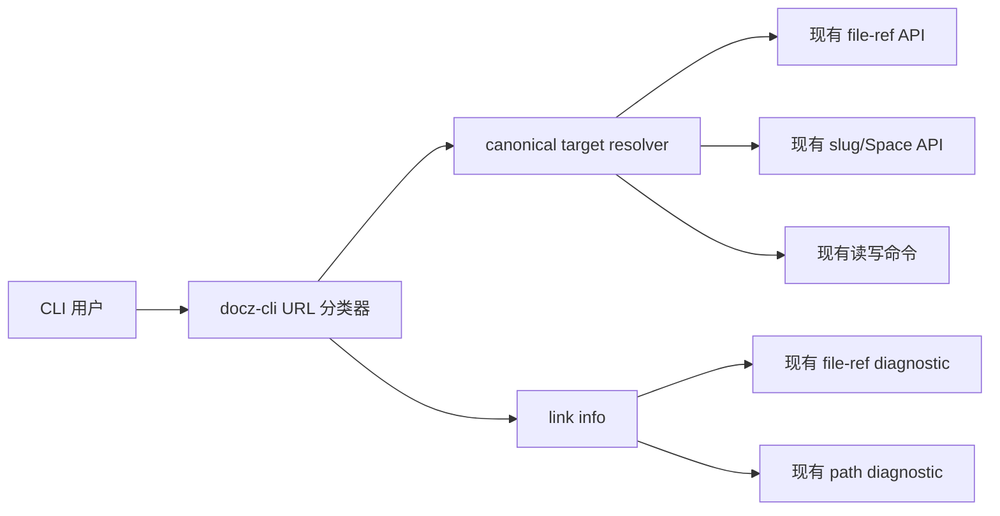
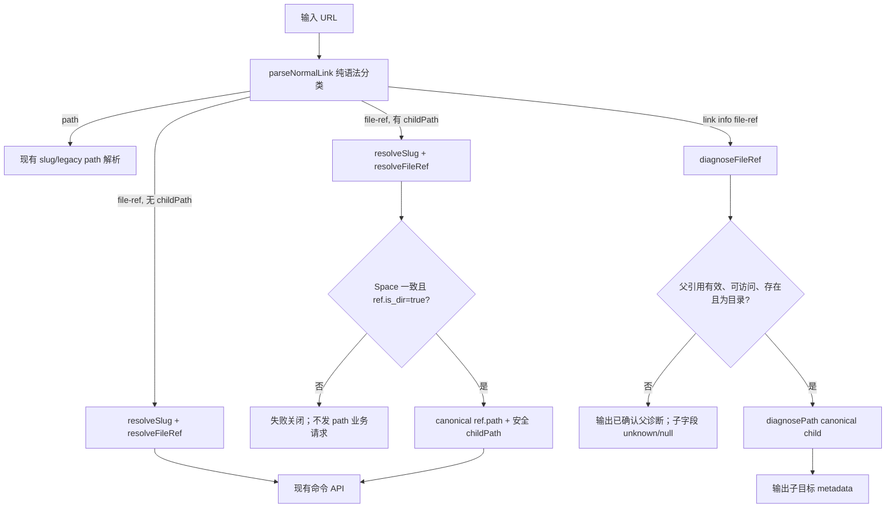

## 方案概述

### 背景

`docz-cli` 0.11.1 对 `/s/{slug}/f/{fileId}` 使用 fileId 解析，但追加子路径后会被宽泛的 `/s/{slug}/{path}` 分支接管，导致目标退化为 Space 根目录下的 `f/{fileId}/...`。

### 目标

在不改服务端的前提下，让所有接受普通 Docz URL 的命令共享同一套稳定短链语法分类和 canonical 目标解析；目录稳定短链允许追加安全子路径，无法安全确认目标时必须失败关闭。

本次不解决服务端 URL 路由、fileId 到路径之间既有的 TOCTOU 窗口，也不改变 `mv` 目的路径和 `space:path` 的现有语义。

### 范围边界



- 客户端范围：`src/commands.ts` 的 URL 分类、目标解析和 `link info`；`src/client.ts` 的响应类型补全；相关测试、README、Skill 文档和 changeset。
- 服务端范围：不修改；仅复用现有 `resolveBySlug`、`resolveFileRef`、`diagnoseFileRef` 和 `diagnosePath`。
- 数据范围：无数据库、缓存或持久化模型变更。

### 基线与依赖

- 实施基线为 `origin/main` 的 `b53f23e`，package/tag 版本均为 `0.11.1`。
- 该基线已经包含 Task 2363 引入的 `parseNormalLink`、`NormalLinkInfo`、`diagnoseFileRef`、`diagnosePath` 和 `link info`，本变更不依赖未合并分支，也不携带额外的 link-metadata 实现。
- test-uts 真机使用同一 `dist/` 构建验证；若基线发生变化，须重新确认上述符号及 file-ref 响应契约后再移植。

### 核心价值

- 消除目录稳定短链追加子路径时的静默错写风险。
- 保留 `link info` 对真实 canonical 子路径的只读诊断能力。
- 让读命令、写命令和诊断命令遵守相同 URL 语义，后续不再出现双解析器漂移。

## 整体设计

### 领域名词定义

| 名词 | 英文 | 定义 |
| --- | --- | --- |
| 稳定短链 | stable link | `/s/{slug}/f/{fileId}` 形式、以 fileId 标识文档身份的 URL |
| 稳定短链子路径 | stable-link child path | 稳定短链后追加的相对路径，仅在 fileId 指向目录时成立 |
| canonical 目标 | canonical target | 服务端 file-ref 返回的真实 `space_id` 和 `path`，以及其下经校验拼接的子路径 |
| 普通路径 URL | ordinary path URL | `/s/{slug}/{path}` 或 `/spaces/{spaceId}/{path}`，直接以 Space 根相对路径寻址 |
| 失败关闭 | fail closed | 无法确认 fileId、Space 一致性、目录类型或子路径安全时停止，不回退到普通路径请求 |

### 系统用例

- 精确稳定短链继续按 fileId 解析。
- 目录稳定短链追加安全子路径后，所有普通目标命令访问 canonical 子路径。
- `link info` 返回 canonical 子路径的存在性、类型和路径。
- fileId 指向文件、引用无效、Space 不一致或子路径非法时，在业务路径请求前报错。
- 普通 slug URL、legacy URL、Space 根 URL、query/fragment 和 `space:path` 保持兼容。

### 方案选型

#### 方案 A：所有稳定短链后缀直接拒绝

实现最小且能消除错写，但用户无法用目录稳定短链自然定位子文件，`link info` 也失去真实路径诊断能力。

#### 方案 B：统一分类并通过 file-ref 解析 canonical 子路径

语法层将 `/s/{slug}/f/{fileId}[/{childPath}]` 始终识别为 file-ref；运行时先确认 Space、fileId 与目录类型，再拼接安全子路径。普通命令和 `link info` 共享分类结果，分别走解析 API 和诊断 API。

优点是符合稳定链接的身份语义、支持用户期望的目录子路径，并能集中建立失败关闭边界。代价是目录子路径命令会比普通 path 多一次或两次只读解析请求。

#### 方案 C：仅在各命令执行前调用 `link info`

可以短期挡住部分写请求，但会复制判断、增加网络调用，并继续保留 `resolveUrl` 与 `parseNormalLink` 的语义分叉，容易遗漏命令。

#### 方案对比

选择方案 B。它是唯一同时满足“`link info` 查真实路径”“所有读写命令一致”和“无服务端修改”的方案。

### 系统架构与调用流



### 模块划分及职责

| 模块 | 核心职责 |
| --- | --- |
| URL 语法分类器 | 纯函数识别 file-ref/path/legacy；逐段解码并校验 child path；`/f/` 命中后不再回退 |
| canonical target resolver | 用 slug 和 file-ref 取得真实 Space/path；校验 Space 一致性和目录类型；向现有命令返回 `{spaceId, path}` |
| link diagnostic resolver | 先诊断稳定父引用，满足条件后再诊断 canonical 子路径；失败时不请求根目录 `f/...` |
| 命令注册层 | 继续通过 `resolveTarget` 复用统一 resolver；`mv` 只解析 source，upload 保留目标目录语义 |

## URL 分类与路径安全设计

### 数据模型

`NormalLinkTarget` 的 file-ref 分支改为：

```ts
{
  kind: 'file-ref';
  slug: string;
  fileId: string;
  childPath: string;
}
```

`FileRef` 补充服务端已返回但当前类型未声明的 `slug: string` 与 `is_dir: boolean`。这是客户端类型对齐，不改变接口协议。

该前提已经用两个环境的只读响应确认：生产目录 fileId `nibMkBMl` 的 `GET /api/file-refs/{id}` 返回 `space_id`、`slug`、`path`、`is_dir=true`；test-uts 本次隔离目录的同一端点也通过目录 child 解析和 mutation 验证。运行时仍不信任 TypeScript 声明：有 child path 时必须检查 `ref.is_dir === true`，字段缺失与 `false` 一样失败关闭；自动化测试覆盖缺字段场景。

### 语法优先级

1. 拒绝 `/share/...`，保持 `docz share info` 分流。
2. 优先匹配 `/s/{slug}/f/{fileId}`，允许一个可选尾斜杠或后续 child path。
3. 一旦 pathname 的路由标记是 `/f/`，解析或校验失败直接报错，不进入普通 slug path 分支。
4. 其余 `/s/{slug}[/{path}]` 和 `/spaces/{spaceId}[/{path}]` 保持现有行为。
5. query 和 fragment 由 `URL.pathname` 自然排除；精确稳定短链尾斜杠等价于空 child path。

### child path 校验

child path 按 URL 原始 `/` 分段，对每段单独 `decodeURIComponent`，避免 `%2F` 在整体解码后悄悄增加层级。任一条件命中即拒绝：

- 空的内部 segment；
- `.` 或 `..`；
- 解码后包含 `/` 或 `\\`；
- 包含 U+0000 到 U+001F 或 U+007F 控制字符。

合法 Unicode 和空格保持原文本。校验后的 segment 用 `/` 连接，再与 canonical 父路径连接；父路径为空时不产生前导 `/`。

目标文件系统已有更严格命名限制继续由现有服务端/命令校验负责，本层只承担“不能逃离或歧义改变 canonical 父目录”的安全边界。

## canonical 解析设计

### 普通目标命令

`resolveUrl` 不再维护独立 regex，而是调用 `parseNormalLink`：

- `path`：保持现有 slug/spaceId 解析。
- `file-ref`：并行意图上需要两个事实，但按现有 API 顺序调用 `resolveSlug(slug)` 和 `resolveFileRef(fileId)`；随后比较 `space.id === ref.space_id`。
- 空 child path：返回 `{spaceId: ref.space_id, path: ref.path}`，保持精确短链行为。
- 非空 child path：要求 `ref.is_dir === true`，返回 canonical join 后的路径。

任何引用不存在、无权限、Space 不一致或非目录错误都向上传播，且不得调用 cat/write/upload/mkdir/mv 等 path 业务 API。

调用链覆盖所有已有 `resolveTarget` 消费者：`ls/cat/upload/write/mkdir/rm/mv(source)/log/rollback/restore/comment/share/shortlink/collab/diff`。不改变各命令解析完成后的业务逻辑。

`resolveSpaceArg` 也复用同一个 `resolveUrl`。因此即使调用方最终只取 Space，稳定链接仍必须完成 canonical 解析并继承 fail-closed：合法目录 child 可返回父 Space；文件后缀、非法 child、无效 fileId 或 Space 不一致会报错。这是有意的安全收紧，避免“只取 Space”的命令成为歧义 URL 的旁路。

`src/mcp.ts` 不接收普通 Docz URL target，而是使用结构化的 `space` 与 `path` 参数并直接 `resolveSpace`，不存在第二套 URL parser；本变更不改变 MCP schema。若未来 MCP 接受 URL，必须复用本模块的 classifier/resolver，不能独立解析。

### `link info`

精确 file-ref 保持一次 `diagnoseFileRef(fileId, slug)`。

存在 child path 时：

1. 调用 `diagnoseFileRef(fileId, slug)`。
2. 仅当父诊断同时满足 `link_valid`、`space_exists`、`has_space_access`、`document_applicable`、`document_exists`、`is_dir === true`，并提供 `space_id` 与 `path` 时，构造 canonical child path。
3. 调用 `diagnosePath({spaceId: parent.space_id, path: childPath})`，输出既有 `NormalLinkInfo` 映射结果。
4. 父引用无效、不可访问、不存在、非目录或字段不足时，不调用 `diagnosePath`。输出保留父诊断可确认的 link/Space/admin 信息，但 `document_path=null`、`document_status=unknown`、`is_folder=null`；设置非零退出码并给出可区分原因的 warning。

这样“这种 URL 可以 `link info`”，但只能在父目录身份已确认后查看真实子路径；不再把它解释为 Space 根路径。

### 失败语义

- 纯语法错误：命令失败，零网络请求。
- file-ref/slug 请求失败：命令失败，零 path 业务请求。
- `link info` 父诊断返回明确无效状态：输出父事实与未知子事实，退出码 1。
- `link info` 网络或响应未知：沿用 unknown 输出，退出码 2。
- 子 path diagnostic 成功返回不存在：仍是合法链接，`document_status=not_found`，退出码 0。

`link info --json` 的完整关键字段契约如下；warning 走 stderr，不给 JSON 临时增加未稳定字段：

| 场景 | exit | link_status | space_permission | document_path | document_status | is_folder |
| --- | ---: | --- | --- | --- | --- | --- |
| canonical child 存在 | 0 | valid | accessible | canonical child | exists | child 类型 |
| canonical child 不存在 | 0 | valid | accessible | canonical child | not_found | null |
| 父 fileId 无效 | 1 | invalid | 父诊断事实 | null | unknown | null |
| 父 Space 不可访问/文档删除 | 1 | 父诊断事实 | 父诊断事实 | null | unknown | null |
| 父是文件或缺少 `is_dir`/identity 字段 | 1 | valid | accessible | null | unknown | null |
| 网络、5xx 或非法响应 | 2 | unknown | unknown | null | unknown | null |

## 兼容性与风险

### 兼容行为

- 精确 `/s/{slug}/f/{fileId}`、可选尾斜杠、query、fragment 保持 fileId 解析。
- `/s/{slug}/{path}`（除保留的 `/f/`）、`/s/{slug}` 与 `/spaces/{spaceId}/{path}` 保持原语义。
- 真实 Space 根目录下以 `f/` 开头的路径仍可用 `space:path` 明确访问。
- 无 CLI 参数和服务端接口变化。

### 行为收紧

- 过去被误当普通路径的 `/s/{slug}/f/{anything...}` 现在全部保留为稳定引用路由。依赖旧歧义行为访问根目录 `f/...` 的脚本需要改用 `space:path`。
- fileId 属于另一 Space 时，即使 URL slug 对应 Space 中碰巧存在相同文本路径也会拒绝。
- child path 对 traversal、编码分隔符和控制字符的拒绝比普通 path 更严格。
- 精确稳定短链过去在 slug Space 与 ref Space 不一致时会把 `ref.path` 投到 slug Space；现在也会明确拒绝。这是修复潜在错目标，而非完全兼容行为。
- `resolveSpaceArg` 对带后缀的文件稳定链接也会 fail closed，即使调用命令最终只需要 Space。

### 已知风险

- file-ref 解析后到写请求之间仍存在路径移动的 TOCTOU；本次与精确稳定短链的既有行为一致，不新增服务端能力。
- 多一次只读解析请求带来轻微延迟；安全性优先，且只影响稳定链接输入。
- 服务端旧版本若不返回 `is_dir`，有 child path 的稳定链接会失败关闭；精确稳定短链不受影响。

### upload 与 mv 语义

- `upload local.md /s/{slug}/f/{dirId}/sub/notes` 把 canonical `sub/notes` **整体作为目录**，最终文件是 `sub/notes/local.md`；不存在目录继续沿用 upload 自动创建目录的现有行为，不把 URL 末段改成远端文件名。
- `mv <stable-child-source> archive/result.md` 只 canonical 解析 source；destination 始终是 Space 根相对完整路径 `archive/result.md`，不是稳定父目录相对路径。
- README 和 Skill 同步说明这两个不对称口径，避免形成新的隐式目标假设。

## 测试与验证

### 自动化测试

- parser：精确链接、尾斜杠、嵌套 Unicode、query/fragment、非法编码、空段、`.`/`..`、`%2F`、`%5C`、控制字符。
- resolver：canonical Space/path、slug/ref Space 不一致、非目录/缺少 `is_dir` 的 child、file-ref 请求失败，以及失败后没有 path 业务请求。
- `resolveSpaceArg`：合法目录 child 返回 canonical Space，文件后缀和非法 child 继续 fail closed。
- `link info`：canonical child exists/not_found；父 invalid/inaccessible/deleted/non-dir/unknown 时不调用 `diagnosePath`。
- 命令共享链路：至少覆盖读、写、upload、mkdir 与 mv source 的代表性请求，断言请求 URL 中不存在根目录 `f/{fileId}`。
- 回归：普通 slug/legacy/Space root/exact stable URL 保持输出。

### 本地门禁

运行项目定义的 typecheck、lint、全量测试和 build；changeset 采用 patch 级别。

### test-uts 真机验证

本仓库是 CLI，不向 test-uts 部署服务。测试部署口径为：构建本分支 CLI artifact，并设置 `DOCSYNC_BASE_URL=https://docz-test-uts.zhenguanyu.com` 运行它。

在 test-uts 创建唯一命名的隔离测试目录和文件，获取目录 fileId 后验证：

- `link info --json <directory-stable-link>/<child>` 返回 canonical child path；不存在 child 返回 `not_found`。
- `write/mkdir/upload/cat/mv` 的代表性操作落在 canonical 目录内。
- file stable link 追加后缀、Space 不一致和 traversal 在 mutation 前失败。
- 测试完成后删除本次隔离目录，并复查不存在；记录所有远端写入和清理结果。

不使用生产复现目录，不读取本地 Docz 同步目录，不发布生产版本。
